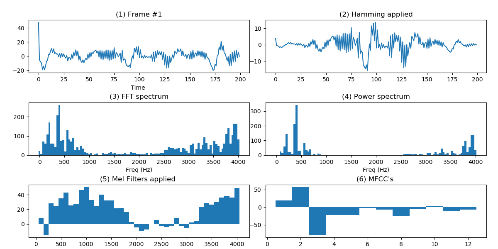
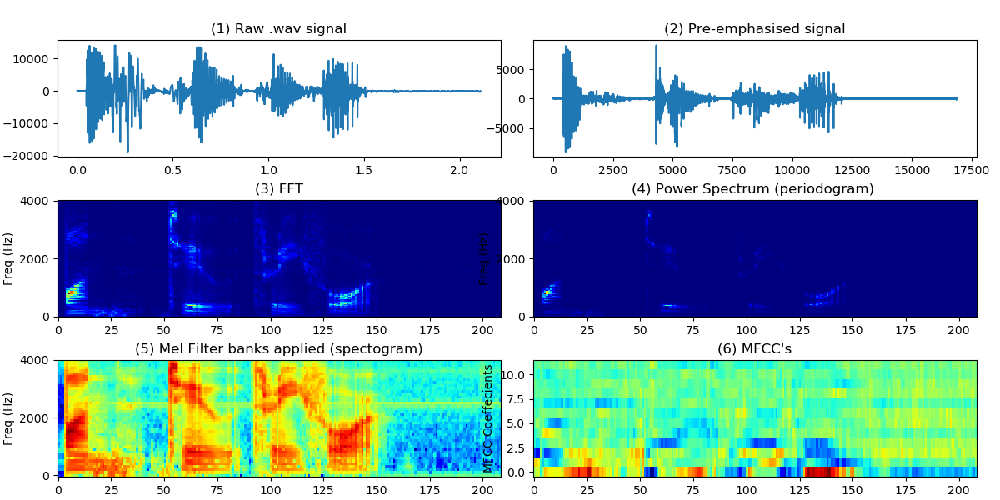

# Python Example. Speech Processing for Automatic Speech Recognition (ASR) with Filter banks & Mel-Frequency Cepstral Coefficients (MFCCs). 
This is sample python code to help understanding steps of Mel Cepstral feature extraction, as used in Automatic Speech Recognition (ASR), Automatic Speaker Verification and Machine Learning. 

Most code attributed to [Haytham Fayek's blog post (read it!)](https://haythamfayek.com/2016/04/21/speech-processing-for-machine-learning.html)  - 

[ETSI standard ES 201 108 V1.1.3](https://www.etsi.org/deliver/etsi_es/201100_201199/201108/01.01.03_60/es_201108v010103p.pdf) also gives a detailed description of Front-end feature extraction algorithm for Distributed speech recognition which uses the same process 

For a good overview of Speaker Recognition read [Speaker Recognition: A Tutorial. JOSEPH P.  CAMPBELL (1997)]( https://pdfs.semanticscholar.org/298c/d5cefda80cd2aa0e9bc1d27f552b9eb18633.pdf)


## Setting up 
Install python from https://www.python.org/, then install following libs;
```
pip install numpy
pip install scipy
pip install matplotlib
```

## Results
Using the [sample .wav](src/1234.wav) file provided (1,2,3,4 spoken in English).

```
Sound file duration 2.11(secs), 16880 samples
Sampling rate 8000Hz (8000 samples per sec)
-Framing-
Frame length: 200 samples, 25ms
Frame overlapp: 15ms
No. of frames: 209
-Filter Banks-
No. of filter banks: 40 (spectogram array size)
-MCC's-
No. of coeffecients: 12

```
 Plot of steps for processing the first frame of speech. Frame length 200 samples (25ms) results in 12 Mel-frequency Cepstral Coefficients. 


Plot of steps for processing whole speech sample (above steps repeated on every frame)



